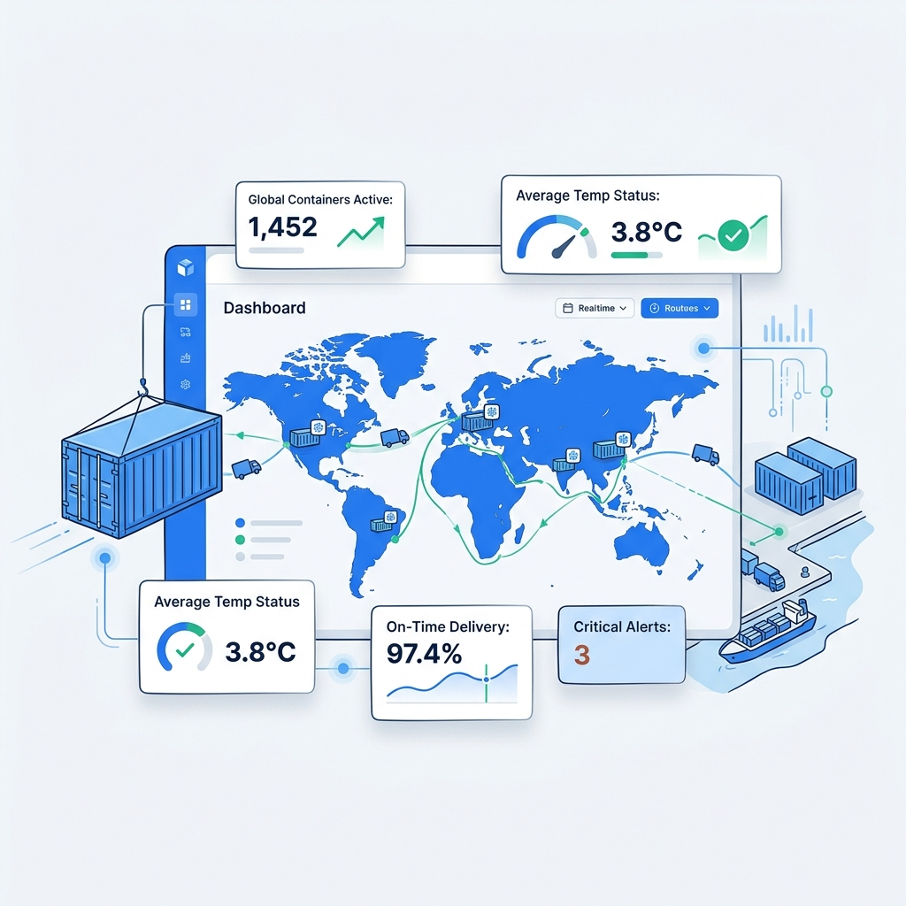

# 🚛 GAT-RL: Cold Chain AI Intelligence Platform

**GAT-RL** is a premium, AI-powered logistics optimization platform designed to eliminate vaccine and food spoilage through real-time autonomous diagnostics, predictive risk modeling, and intelligent routing.



---

## 📈 Quantified Business Impact (Annual ROI)
Based on a controlled analysis of a mid-sized fleet (100 trucks), GAT-RL delivers the following estimated impact:

| Metric | Annual Estimate | Core Logic |
| :--- | :--- | :--- |
| **Operational Efficiency** | **8,320 Hours Saved** | 80% automation of manual monitoring labor |
| **Direct Cost Reduction** | **$45,000,000** | 60% reduction in baseline 5% spoilage rate |
| **Revenue Recovery** | **$60,000,000** | 40% improvement in critical event survival |
| **Total Financial Gain** | **$105M+ / Year** | Combined savings from waste & recovery |

*Assumptions: $1.5B annual throughput value, $50k avg shipment value, 5 FTE monitoring staff.*

---

## 🧠 The AI Agent (Real-Time Brain)
The heart of GAT-RL is the **Autonomous AI Agent**, a real-time diagnostic engine that monitors every shipment in the simulation.

- **Auto-Triggering**: The agent automatically springs into action if any shipment's risk level exceeds **85%**.
- **Deep Diagnostics**: Analyzes Hardware Health (Compressor efficiency), Backup Power status, and Cargo Integrity.
- **Dynamic Rerouting**: Provides immediate emergency reroute recommendations to the nearest Tier-1 Cold Hubs with precise ETAs.
- **Product-Specific Intelligence**: Uses tailored safety thresholds for Vaccines, Dairy, and Fruits.

---

## ✨ Key Features
- **Live Telemetry Simulation**: Real-time tracking of temperature, humidity, and transit progress across global routes.
- **Predictive Risk Modeling**: AI-driven spoilage probability engine.
- **Secure Authentication**: Firebase-powered Login/Signup with a **Developer Bypass Mode** for instant testing.
- **Premium Streaming UI**: Smooth, sequentially animated diagnostic steps for a modern "AI-at-work" experience.
- **Real-Time Alert Feed**: Live notification system for thermal breaches and transit delays.

---

## 🛠️ Technology Stack

### Frontend
- **Framework**: React 18 + TypeScript
- **Bundler**: Vite
- **Styling**: Tailwind CSS + Shadcn UI
- **Animations**: Framer Motion
- **Auth/Database**: Firebase (Auth & Realtime Database)

### Backend
- **Engine**: Python 3.x
- **Framework**: Flask + Flask-CORS
- **AI Logic**: Custom heuristic diagnostic engine (Services layer)

---

## 🚀 Getting Started

### 1. Prerequisite: Setup Firebase
1. Create a project at [Firebase Console](https://console.firebase.google.com/).
2. Enable **Authentication** (Email/Password) and **Realtime Database**.
3. Set your Realtime Database Rules to:
   ```json
   {
     "rules": {
       "alerts": { "$uid": { ".read": "$uid === auth.uid", ".write": "$uid === auth.uid" }},
       "plans": { "$uid": { ".read": "$uid === auth.uid", ".write": "$uid === auth.uid" }}
     }
   }
   ```

### 2. Run the Application
You can run both the Frontend and the Backend simultaneously:

```bash
# Install dependencies
npm install

# Run Frontend & Python Backend concurrently
npm run dev
```

---

## 🛠️ Developer Mode (Instant Access)
If you haven't set up Firebase yet, you can still explore the app's features:
1. Hit the **⚡ BYPASS LOGIN** button on the sign-in screen.
2. The AI Agent will use **Offline Fallback Logic** if the Python server is not detected, ensuring the UI remains fully interactive.

---

### Author
**Anushka Jadhav**
*Developed as an AI-powered logistics solution for modern cold chain challenges.*
